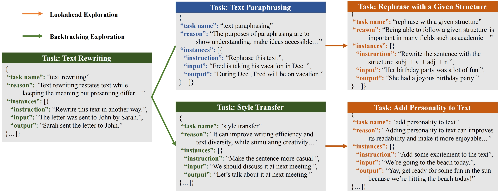
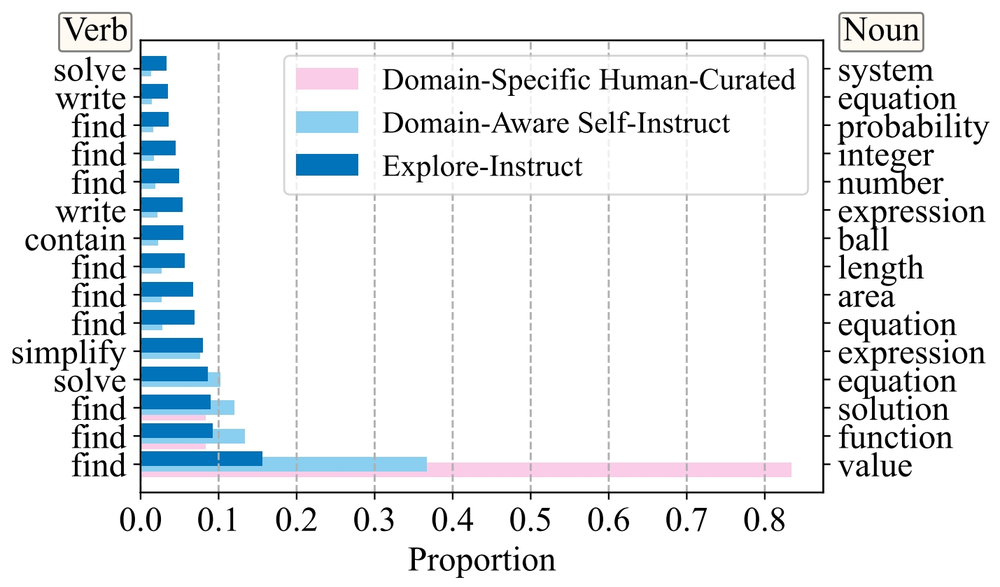
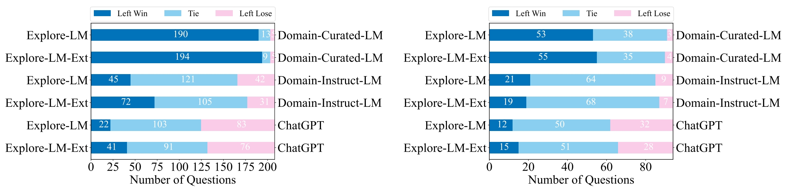

<p align="center" width="100%">
</p>

<div id="top" align="center">

Explore-Instruct: Enhancing Domain-Specific Instruction Coverage through Active Exploration
-----------------------------

[](https://github.com/tatsu-lab/stanford_alpaca/blob/main/LICENSE)
[](https://github.com/tatsu-lab/stanford_alpaca/blob/main/DATA_LICENSE)
[](https://github.com/tatsu-lab/stanford_alpaca/blob/main/WEIGHT_DIFF_LICENSE)
[](https://www.python.org/downloads/release/python-380/)
[](https://github.com/psf/black)

<h4> |<a href="https://arxiv.org/abs/2310.09168"> 📑 Paper </a> |
<a href="https://huggingface.co/datasets?sort=trending&search=Explore_Instruct"> 🤗 Data </a> |  
<a href="https://huggingface.co/models?sort=trending&search=Explore-LM"> 🤗 Model </a> |
<a href="https://github.com/fanqiwan/Explore-Instruct"> 🐱 Github Repo </a> |
</h4>

<!-- **Authors:** -->

_**Fanqi Wan<sup>†</sup>, Xinting Huang<sup>‡</sup>, Tao Yang<sup>†</sup>, Xiaojun Quan<sup>†</sup>, Wei Bi<sup>‡</sup>, Shuming Shi<sup>‡</sup>**_


<!-- **Affiliations:** -->


_<sup>†</sup> Sun Yat-sen University,
<sup>‡</sup> Tencent AI Lab_

</div>


## News
- **Oct 16, 2023:** 🔥 We're excited to announce that the Explore-Instruct datasets in brainstorming, rewriting, and math domains are now available on 🤗 [Huggingface Datasets](https://huggingface.co/datasets?sort=trending&search=Explore_Instruct)! Additionally, we've released Explore-LM models that have been initialized with LLaMA-7B and fine-tuned with the Explore-Instruct data in each domain. You can find these models on 🤗 [Huggingface Models](https://huggingface.co/models?sort=trending&search=Explore-LM). Happy exploring and instructing!

## Contents

- [Overview](#overview)
- [Data Release](#data-release)
- [Model Release](#model-release)
- [Data Generation Process](#data-generation-process)
- [Fine-tuning](#fine-tuning)
- [Evaluation](#evaluation)
- [Limitations](#limitations)
- [License](#license)
- [Citation](#citation)
- [Acknowledgements](#acknowledgments)

## Overview

We propose Explore-Instruct, a novel approach to enhancing domain-specific instruction coverage. We posit that the domain space is inherently structured akin to a tree, reminiscent of cognitive science ontologies. Drawing from the essence of classical search algorithms and incorporating the power of LLMs, Explore-Instruct is conceived to actively traverse the domain space and generate instruction-tuning data, **not** necessitating a predefined tree structure. Specifically, Explore-Instruct employs two strategic operations: lookahead and backtracking exploration:

- **Lookahead** delves into a multitude of potential fine-grained sub-tasks, thereby mapping out a complex network of tasks

- **Backtracking** seeks alternative branches to widen the search boundary, hence extending the domain spectrum.

<p align="center">
     <br>
</p>

## Data Release

We release the Explore-Instruct data in brainstorming, rewriting, and math domains on 🤗 [Huggingface Datasets](https://huggingface.co/datasets?sort=trending&search=Explore_Instruct). Each domain includes two versions of datasets: the basic and extended version. The base version contains 10k instruction-tuning data and the extended version contains 16k, 32k, and 64k instruction-tuning data for each domain respectively. Each dataset is a structured data file in the JSON format. It consists of a list of dictionaries, with each dictionary containing the following fields:

- `instruction`: `str`, describes the task the model should perform. 
- `input`: `str`, optional context or input for the task.
- `output`: `str`, ground-truth output text for the task and input text.

The results of data-centric analysis are shown as follows:

<p align="left">
     <br>
</p>

| Method                          | Brainstorming Unique<br/>V-N pairs | Rewriting Unique<br/>V-N pairs | Math Unique<br/>V-N pairs |
|:--------------------------------|:----------------------------------:|:------------------------------:|:-------------------------:|
| _Domain-Specific Human-Curated_ |                 2                  |               8                |             3             |
| _Domain-Aware Self-Instruct_    |                781                 |              1715              |            451            |
| Explore-Instruct                |              **790**               |            **2015**            |          **917**          |

## Model Release

We release the Explore-LM models in brainstorming, rewriting, and math domains on 🤗 [Huggingface Models](https://huggingface.co/models?sort=trending&search=Explore-LM). Each domain includes two versions of models: the basic and extended version trained with the corresponding version of dataset.

The results of automatic and human evaluation in three domains are shown as follows:

- Automatic evaluation:

| Automatic Comparison in the Brainstorming Domain | Win:Tie:Lose | Beat Rate |
|:-------------------------------------------------|:------------:|:---------:|
| Explore-LM vs Domain-Curated-LM                  |   194:1:13   |   93.72   |
| Explore-LM-Ext vs Domain-Curated-LM              |   196:1:11   |   94.69   |
| Explore-LM vs Domain-Instruct-LM                 |  114:56:38   |   75.00   |
| Explore-LM-Ext vs Domain-Instruct-LM             |  122:55:31   |   79.74   |
| Explore-LM vs ChatGPT                            |   52:71:85   |   37.96   |
| Explore-LM-Ext vs ChatGPT                        |   83:69:56   |   59.71   |


| Automatic Comparison in the Rewriting Domain | Win:Tie:Lose | Beat Rate |
|:---------------------------------------------|:------------:|:---------:|
| Explore-LM vs Domain-Curated-LM              |   50:38:6    |   89.29   |
| Explore-LM-Ext vs Domain-Curated-LM          |   53:37:4    |   92.98   |
| Explore-LM vs Domain-Instruct-LM             |   34:49:11   |   75.56   |
| Explore-LM-Ext vs Domain-Instruct-LM         |   35:53:6    |   85.37   |
| Explore-LM vs ChatGPT                        |   11:59:24   |   31.43   |
| Explore-LM-Ext vs ChatGPT                    |   12:56:26   |   31.58   |


| Automatic Comparison in the Math Domain | Accuracy Rate |
|:----------------------------------------|:-------------:|
| Domain-Curated-LM                       |      3.4      |
| Domain-Instruct-LM                      |      4.0      |
| Explore-LM                              |      6.8      |
| Explore-LM-Ext                          |      8.4      |
| ChatGPT                                 |     34.8      |

- Human evaluation:

<p align="left">
     <br>
</p>

## Data Generation Process

To generate the domain-specific instruction-tuning data, please follow the following commands step by step:

### Domain Space Exploration
```
python3 generate_instruction.py \
    --action extend \
    --save_dir ./en_data/demo_domain \  # input dir include current domain tree for exploration 
    --out_dir ./en_data/demo_domain_exploration \  # output dir of the explored new domain tree
    --lang <LANGUAGE> \  # currently support 'en'
    --domain demo_domain \  # domain for exploration
    --extend_nums <TASK_NUMBER_DEPTH_0>,...,<TASK_NUMBER_DEPTH_MAX_DEPTH-1> \  # exploration breadth at each depth 
    --max_depth <MAX_DEPTH> \  # exploration depth
    --assistant_name <ASSISTANT_NAME>  # currently support openai and claude
```

### Instruction-Tuning Data Generation
```
python3 generate_instruction.py \
    --action enrich \
    --save_dir ./en_data/demo_domain_exploration \  # input dir include current domain tree for data generation 
    --out_dir ./en_data/demo_domain_generation \  # output dir of the domain tree with generated data
    --lang <LANGUAGE> \  # currently support 'en'
    --domain demo_domain \  # domain for exploration
    --enrich_nums <DATA_NUMBER_DEPTH_0>,...,<DATA_NUMBER_DEPTH_MAX_DEPTH> \  # data number for task at each depth 
    --enrich_batch_size <BATCH_SIZE> \  # batch size for data generation
    --assistant_name <ASSISTANT_NAME>  # currently support openai and claude
```

### Task Pruning
```
python3 generate_instruction.py \
    --action prune \
    --save_dir ./en_data/demo_domain_generation \  # input dir include current domain tree for task pruning 
    --out_dir ./en_data/demo_domain_pruning \  # output dir of the domain tree with 'pruned_subtasks_name.json' file
    --lang <LANGUAGE> \  # currently support 'en'
    --domain demo_domain \  # domain for exploration
    --pruned_file ./en_data/demo_domain_pruning/pruned_subtasks_name.json \  # file of pruned tasks
    --prune_threshold <PRUNE_THRESHOLD> \  # threshold of rouge-l overlap between task names
    --assistant_name <ASSISTANT_NAME>  # currently support openai and claude
```

### Data Filtering
```
python3 generate_instruction.py \
    --action filter \
    --save_dir ./en_data/demo_domain_pruning \  # input dir include current domain tree for data filtering 
    --out_dir ./en_data/demo_domain_filtering \  # output dir of the domain tree with fitered data
    --lang <LANGUAGE> \  # currently support 'en'
    --domain demo_domain \  # domain for exploration
    --pruned_file ./en_data/demo_domain_pruning/pruned_subtasks_name.json \  # file of pruned tasks
    --filter_threshold <FILTER_THRESHOLD> \  # threshold of rouge-l overlap between instructions
    --assistant_name <ASSISTANT_NAME>  # currently support openai and claude
```

### Data Sampling
```
python3 generate_instruction.py \
    --action sample \
    --save_dir ./en_data/demo_domain_filtering \  # input dir include current domain tree for data sampling 
    --out_dir ./en_data/demo_domain_sampling \  # output dir of the domain tree with sampled data
    --lang <LANGUAGE> \  # currently support 'en'
    --domain demo_domain \  # domain for exploration
    --pruned_file ./en_data/demo_domain_filtering/pruned_subtasks_name.json \  # file of pruned tasks
    --sample_example_num <SAMPLE_EXAMPLES_NUM> \  # number of sampled examples
    --sample_max_depth <SAMPLE_MAX_DEPTH> \  # max depth for data sampling
    --sample_use_pruned \  # do not sample from pruned tasks
    --assistant_name <ASSISTANT_NAME>  # currently support openai and claude
```

## Fine-tuning

We fine-tune LLaMA-7B with the following hyperparameters:

| Hyperparameter  |  Global Batch Size |  Learning rate |  Epochs | Max length |  Weight decay |
|:----------------|-------------------:|---------------:|--------:|-----------:|--------------:|
| LLaMA 7B        |                128 |           2e-5 |       3 |        512 |             0 |

To reproduce the training procedure, please use the following command:
 
```
deepspeed --num_gpus=8 ./train/train.py \
    --deepspeed ./deepspeed_config/deepspeed_zero3_offload_config.json \
    --model_name_or_path decapoda-research/llama-7b-hf \
    --data_path ./en_data/demo_domain_sampling \
    --fp16 True \
    --output_dir ./training_results/explore-lm-7b-demo-domain \
    --num_train_epochs 3 \
    --per_device_train_batch_size 2 \
    --per_device_eval_batch_size 2 \
    --gradient_accumulation_steps 8 \
    --evaluation_strategy "no" \
    --model_max_length 512 \
    --save_strategy "steps" \
    --save_steps 2000 \
    --save_total_limit 1 \
    --learning_rate 2e-5 \
    --weight_decay 0. \
    --warmup_ratio 0.03 \
    --lr_scheduler_type "cosine" \
    --logging_steps 1 \
    --prompt_type alpaca \
    2>&1 | tee ./training_logs/explore-lm-7b-demo-domain.log

python3 ./train/zero_to_fp32.py \
    --checkpoint_dir ./training_results/explore-lm-7b-demo-domain \
    --output_file ./training_results/explore-lm-7b-demo-domain/pytorch_model.bin
```

## Evaluation

The evaluation datasets for different domains are as follows:
- Brainstorming and Rewriting: From the corresponding categories in the translated test set of BELLE. ([en_eval_set.jsonl](./eval/question/en_eval_set.jsonl)) 
- Math: From randomly selected 500 questions from the test set of MATH. ([MATH_eval_set_sample.jsonl](./eval/question/MATH_eval_set_sample.jsonl))

The evaluation metrics for different domains are as follows:
- Brainstorming and Rewriting: Both automatic and human evaluations following Vicuna.
- Math: Accuracy Rate metric in solving math problems. 

The automatic evaluation commands for different domains are as follows:

```
# Brainstorming and Rewriting Domain

# 1. Inference
python3 ./eval/generate.py \
    --model_id <MODEL_ID> \
    --model_path <MODEL_PATH> \
    --question_file ./eval/question/en_eval_set.jsonl \
    --answer_file ./eval/answer/<MODEL_ID>.jsonl \
    --num_gpus 8 \
    --num_beams 1 \
    --temperature 0.7 \
    --max_new_tokens 512 \
    --prompt_type alpaca \
    --do_sample

2. Evaluation
python3 ./eval/chatgpt_score.py \
    --baseline_file ./eval/answer/<MODEL_1>.jsonl \  # answer of baseline model to compare with
    --answer_file ./eval/answer/<MODEL_2>.jsonl \  # answer of evaluation model
    --review_file ./eval/review/<MODEL_1>_cp_<MODEL_2>_<DOMAIN>.jsonl \  # review from chatgpt
    --prompt_file ./eval/prompt/en_review_prompt_compare.jsonl \  # evaluation prompt for chatgpt
    --target_classes <DOMAIN> \  # evaluation domain
    --batch_size <BATCH_SIZE> \
    --review_model "gpt-3.5-turbo-0301"
```

```
# Math Domain

# 1. Inference
python3 ./eval/generate.py \
    --model_id <MODEL_ID> \
    --model_path <MODEL_PATH> \
    --question_file ./eval/question/MATH_eval_set_sample.jsonl \
    --answer_file ./eval/answer/<MODEL_ID>.jsonl \
    --num_gpus 8 \
    --num_beams 10 \
    --temperature 1.0 \
    --max_new_tokens 512 \
    --prompt_type alpaca

2. Evaluation
python3 ./eval/auto_eval.py \
    --question_file ./eval/question/MATH_eval_set_sample.jsonl \
    --answer_file ./eval/answer/<MODEL_ID>.jsonl
```

## Limitations

Explore-Instruct is still under development and needs a lot of improvements. We acknowledge that our work focuses on the enhancement of domain-specific instruction coverage and does not address other aspects of instruction-tuning, such as the generation of complex and challenging instructions or the mitigation of toxic and harmful instructions. Future work is needed to explore the potential of our approach in these areas.

## License

Explore-Instruct is intended and licensed for research use only. The dataset is CC BY NC 4.0 (allowing only non-commercial use) and models trained using the dataset should not be used outside of research purposes. The weights of Explore-LM models are also CC BY NC 4.0 (allowing only non-commercial use).

## Citation

If you find this work is relevant with your research or applications, please feel free to cite our work!
```
@misc{wan2023explore,
   title={Explore-Instruct: Enhancing Domain-Specific Instruction Coverage through Active Exploration},
   author={Fanqi, Wan and Xinting, Huang and Tao, Yang and Xiaojun, Quan and Wei, Bi and Shuming, Shi},
   year={2023},
   eprint={2310.09168},
   archivePrefix={arXiv},
   primaryClass={cs.CL}
}
```

## Acknowledgments

This repo benefits from [Stanford-Alpaca](https://github.com/tatsu-lab/stanford_alpaca) and [Vicuna](https://github.com/lm-sys/FastChat). Thanks for their wonderful works!